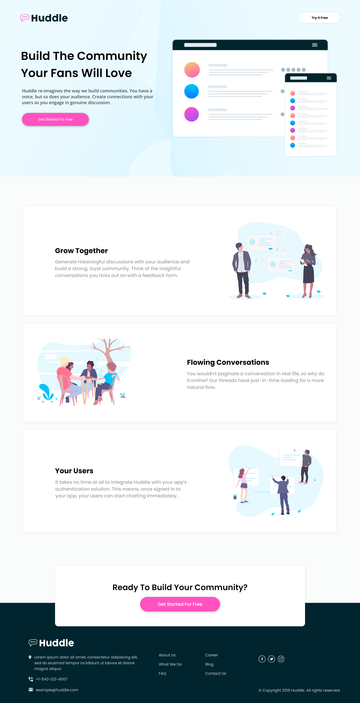
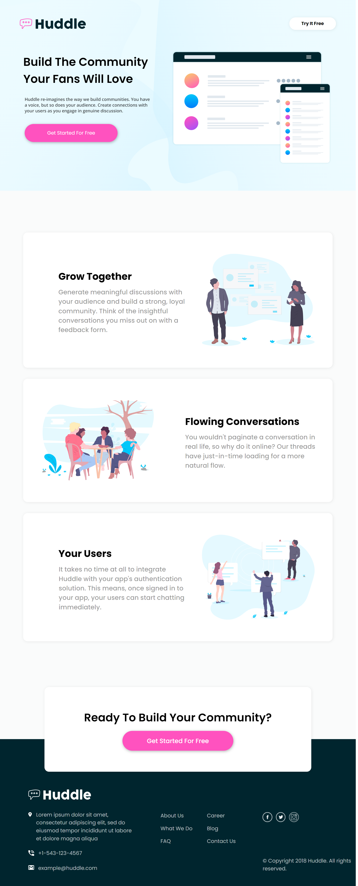
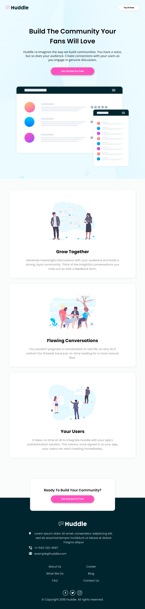
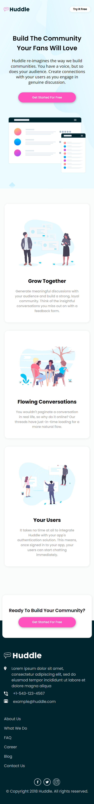

# Frontend Mentor Project 008 - Huddle landing page with alternating feature blocks

This is a solution to the [Huddle landing page with alternating feature blocks challenge on Frontend Mentor](https://www.frontendmentor.io/challenges/huddle-landing-page-with-alternating-feature-blocks-5ca5f5981e82137ec91a5100). Frontend Mentor challenges help you improve your coding skills by building realistic projects.

## Table of contents

- [Overview](#overview)
  - [The challenge](#the-challenge)
  - [Screenshot](#screenshot)
  - [Links](#links)
- [My process](#my-process)
  - [Built with](#built-with)
  - [What I learned](#what-i-learned)
  - [Continued development](#continued-development)
- [Author](#author)

## Overview

### The challenge

Users should be able to:

- View the optimal layout for the site depending on their device's screen size
- See hover states for all interactive elements on the page

### Screenshot

### Links

- Solution URL: [Huddle landing page](https://github.com/Shoaib-Bin-Rashid/Huddle-landing-page-with-alternating-feature-blocks)
- Live Site URL: [Huddle landing page Live](https://shoaib-bin-rashid.github.io/Huddle-landing-page-with-alternating-feature-blocks/)

## My process

Step by step process for building the project by completing html elements for the website then adding required css to design the website as required.

### Built with

- Semantic HTML5 markup
- CSS custom properties
- Flexbox
- CSS Grid
- Mobile-first workflow

### What I learned

I discovered the use of adjusting all the elements to create the project as close as the orginal one.
I faced some issue with the floating card to adjust the position to the center.

### Continued development

I want to focus more on creating more complex designs and also designing things on my own time

## Author

- Website - Well I haven't made my profile portfolio, gonna make it sooon when I know a lot of stuffs
- Linkedin - [Shoaib Bin Rashid](https://www.linkedin.com/in/shoaib-bin-rashid)
- WhatsApp - [+880 1816811419](https://wa.link/urh8bu)
- Telegram - [+880 1816811419](t.me/sho_ai_b_11)
- GitHub - [Shoaib-Bin-Rashid](https://github.com/Shoaib-Bin-Rashid)
- Frontend Mentor - [Shoaib-Bin-Rashid](https://www.frontendmentor.io/profile/Shoaib-Bin-Rashid)
- Twitter - [@ShoaibBinRashi1](https://x.com/ShoaibBinRashi1)
